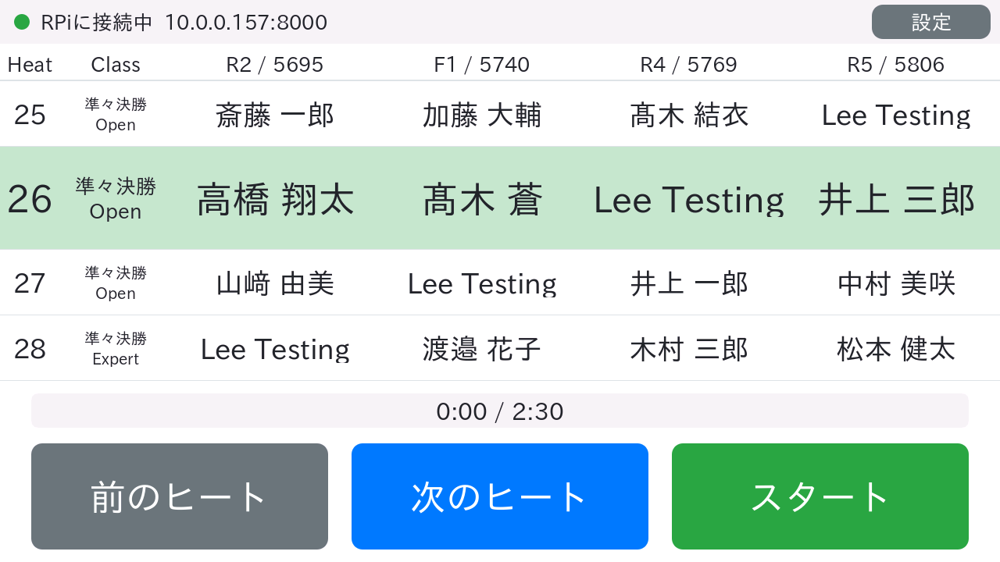
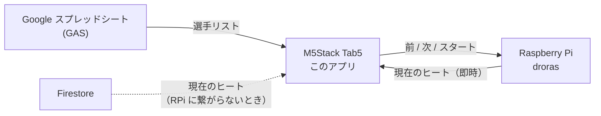
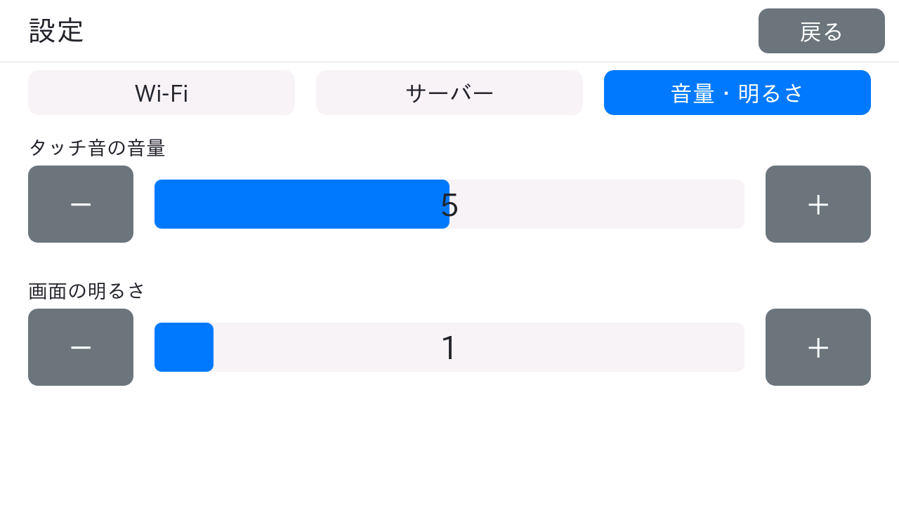

# droras-tab5

ドローンレースの **「いま誰が飛ぶのか」を表示する、手のひらサイズのヒート表**です。
[M5Stack Tab5](https://docs.m5stack.com/en/core/Tab5) で動き、レース進行システム
[droras](https://github.com/a2chub/droras) の操作パネルにもなります。



（画面の選手名はすべて架空のものです）

## これは何？

- **1つ前・現在・次・次の次** の4ヒートの選手名を、チャンネル（R2 / F1 / R4 / R5）ごとに表示します。
- 現在のヒートはいちばん大きく、緑の帯で表示します。
- 画面のボタンで **前のヒート / 次のヒート / スタート** を操作できます。
- パソコンもブラウザも要りません。電源を入れて Wi-Fi に繋がれば動きます。

## しくみ



| 何を | どこから | 補足 |
|---|---|---|
| 選手リスト | Google スプレッドシート（GAS） | 起動時に自動で取得。設定画面から取り直しもできます |
| 現在のヒート | Raspberry Pi の droras | 同じ Wi-Fi にいるとき。操作ボタンもここへ送ります |
| 現在のヒート（予備） | Firestore | droras に繋がらないときだけ使う、表示専用の経路です |

droras に繋がらなくても、インターネットに出られれば **表示だけの掲示板** として動きます。

## 必要なもの

| もの | 備考 |
|---|---|
| M5Stack Tab5 | 本体。USB-C ケーブルでパソコンと繋ぎます |
| 2.4GHz の Wi-Fi | Tab5 は **5GHz に対応していません** |
| パソコン | 書き込み用。macOS で動作確認しています |
| [PlatformIO Core](https://docs.platformio.org/en/latest/core/installation/index.html) | ビルドと書き込みに使います |
| （あれば）droras が動いている Raspberry Pi | 無くても表示専用で動きます |

## はじめかた

### 1. 取得する

```sh
git clone https://github.com/a2chub/droras-tab5.git
cd droras-tab5
```

### 2. Wi-Fi を設定する

ひな形をコピーして、SSID とパスワードを書き込みます。**このファイルは git に入りません。**

```sh
cp src/app_secrets.example.h src/app_secrets.h
```

```c
#define APP_WIFI_1_LABEL "会場"            // ボタンに出る名前（空なら SSID を表示）
#define APP_WIFI_1_SSID "your-wifi-name"
#define APP_WIFI_1_PASSWORD "your-password"
```

4件まで登録でき、どれを使うかは本体の画面で選べます。

### 3. 書き込む

Tab5 を USB で繋いで実行します。

```sh
pio run -e tab5 -t upload
```

初回は必要な道具（数GB）を自動でダウンロードするので時間がかかります。2回目以降は1分ほどです。

### 4. 本体で設定する

起動すると自動で Wi-Fi に繋がり、選手リストを取得します。
droras を使う場合は、右上の **設定 → サーバー** で Raspberry Pi の IP アドレスを入力して保存します
（例: `192.168.1.20`。ポートを省くと 8000 番）。

これで完了です。

## 使い方

### ヒート表

| 操作 | 動き |
|---|---|
| **前のヒート / 次のヒート** | droras の現在ヒートを変えます。ほかの端末の表示も一緒に変わります |
| **スタート** | droras にスタートの合図を送り、150 秒のタイマーを始めます。時間が来ると次のヒートへ進みます |
| **ストップ**（タイマー中） | この端末のタイマーだけを止めます |
| **設定**（右上） | 設定画面を開きます |

左上の丸で、いまどこからヒート情報を取っているかが分かります。

| 色 | 状態 |
|---|---|
| 🟢 緑 | droras に接続中。ボタンで操作できます |
| 🟡 黄 | Firestore から取得中。表示のみで、ボタンは押せません |
| 🔴 赤 | 取得できていません（Wi-Fi 接続中、未設定など） |

### 設定画面



| タブ | できること |
|---|---|
| Wi-Fi | 登録した Wi-Fi の切り替え。いまの IP アドレスの確認 |
| サーバー | droras の IP アドレスの入力。選手リストの取り直し |
| 音量・明るさ | タッチ音の大きさと画面の明るさ |

設定は本体に保存され、電源を切っても残ります。

## 困ったとき

| こうなった | 確認すること |
|---|---|
| 「Wi-Fiが未設定です」と出る | `src/app_secrets.h` に SSID を書いて、書き込み直してください |
| 「Wi-Fiに接続中…」のまま | SSID・パスワードの間違いか、5GHz 専用の Wi-Fi ではありませんか |
| 選手リストが出るまで時間がかかる | スプレッドシート側の応答が遅いことがあります。自動で再試行します |
| ボタンがグレーで押せない | droras に繋がっていません。設定 → サーバーの IP アドレスと、同じ Wi-Fi にいるかを確認してください |
| 名前の一部が表示されない | フォント（IPAex ゴシック）に無い文字です |
| 書き込みに失敗する | USB ケーブルを挿し直してください。ほかのアプリがシリアルポートを開いていませんか |

## もっと詳しく

- [docs/heatboard.md](docs/heatboard.md) … 画面の仕様、データの取得元、ソースの構成、既知の制約
- [docs/development-setup.md](docs/development-setup.md) … 開発環境、実際にはまった点とその理由、出荷時ファームへの戻し方

## 開発する人へ

```sh
pio test -e native                        # ロジック部分の単体テスト（パソコン上で動きます）
python tools/screenshot.py out.png        # 実機の画面を PNG で保存
python tools/screenshot.py out.png --send "tap 640 636"   # タップを送ってから保存
```

`tools/screenshot.py` には pyserial が必要です。上の画面写真もこれで撮っています。

## ライセンス

**ジュースウェア**です（冗談のライセンスです）。正式な文面は [LICENSE](LICENSE) にありますが、要するにこうです。

> このソフトを使う人は、**見知らぬ人にジュースを1本おごること**。

同梱しているフォント（`assets/fonts/ipaexg.ttf`、IPAex ゴシック）はこのライセンスの対象外で、
[IPA フォントライセンス v1.0](assets/fonts/IPA_Font_License_Agreement_v1.0.txt) に従います。
